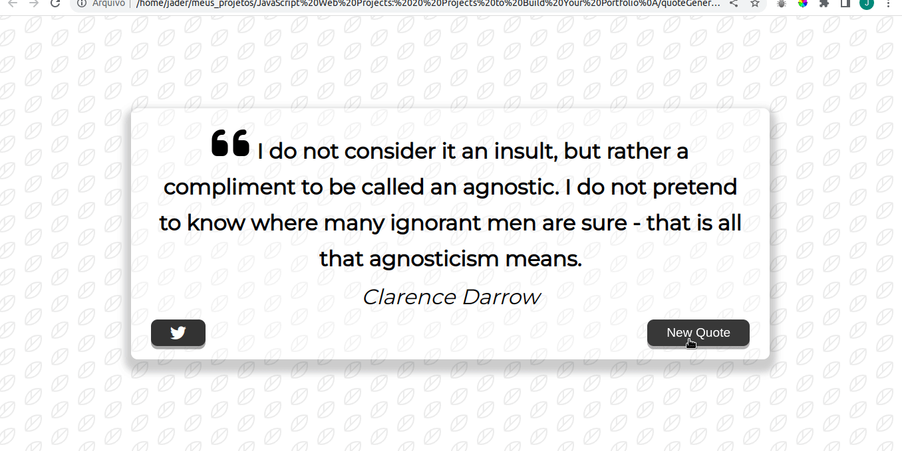
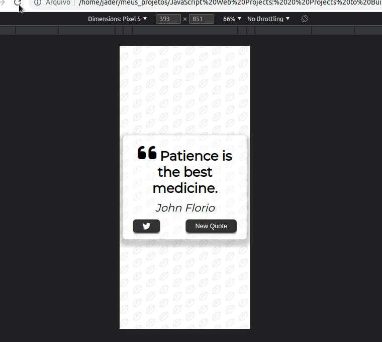

# Projeto Gerador de Citações

Aqui está um projeto que gostei bastante de fazer, onde durante varios ajustes tinha uma nova citação de pensadores, sobre diversas coisas, indo desde frases de Buda até pensadores de nossa época.

Terminei esse projeto já estando quase um filósofo. kkk 

E se você quiser twittar uma citação que tenha gostado, basta clicar no botão do twitter que você será redirecionado diretamente para o seu, só faltando a sua confirmação do tweet.

Projeto responsivo construído em HTML, CSS e JavaScript. Todas as citaçoes sao aleatórias e advindas de uma API externa com mais de 8.000 citações.
 
 

## From Desktop User

 
 

## Responsive

 
 

Made with :heart: by JADER BORGES, veja meu <a href="https://www.linkedin.com/in/jader-borges-3191a522a/">LinkedIn</a>